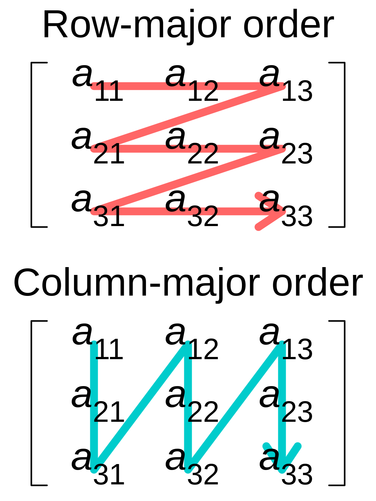

# TP10 - Images

## Objectifs

- Définir et utiliser des templates

## Exercice

Les images sont des tableaux de **pixels**.
On va utiliser des templates pour définir des images de **taille statique** utilisant plusieurs types de pixels.
Tout au long du TP, votre code produira des images dans le dossier `images` situé dans votre dosser de build (pas celui à la racine de votre dossier).

### A. Image

1. Dans un nouveau fichier `src/image.hpp`, vous allez définir une classe template `Image<typename P, size_t W, size_t H>` où (W,H) est la dimension de l'image et P le type utilisé pour les pixels (au début on utilisera des entiers simples).

Attention, l'image doit être stockée en **lignes** et pas en **colones**.

On appelle **row-major** une image qui est stockée ligne par ligne et **column-major** une image qui est stockée colone par colone. Voici un schéma explicatif:



On se place donc dans le cas en rouge.

Vous utiliserez un std::array nesté `std::array<std::array<P, W>, H>` pour stocker les pixels.

2. Définissez les constructeurs suivants :
- un constructeur `Image(const P& pixel)` prenant un pixel de remplissage et construisant une image unie,
- un constructeur par défault `Image()` (on a pas besoin d'initialiser les pixels, vous pouvez utiliser `default`).

3. On veut aussi pouvoir utiliser `img(i,j)` pour accéder au pixel de la j-ème ligne et de la i-ème colone.
Implémentez les deux opérateurs correspondants (la version const retournant une référence constante, et la version non-const retournant une référence non-constante).

4. Le fichier [midgray.cpp](src/midgray.cpp) est un programme permettant de tester votre code.  Le but est de modifier la première ligne du `main` pour produire une image 800x600 en niveau de gris. Tous les pixels devront être en gris moyen (d'une valeur de 128).  On utilisera un entier pouvant aller de 0 à 128 pour `P` (trouver le type approprié). 

   La fonction `image_lib::save` permet d'enregistrer l'image au format png dans votre répertoire de build.

   Compilez le programme et vérifiez que le contenu de l'image générée est bien une image grise de taille 800x600.
   
   N'oubliez pas de linker le fichier `lib/image_lib.cpp`, ou vous aurez des erreurs !


5. Faites le nécessaire pour que l'on puisse additionner deux image de même tailles. Le résultat produira une image dont chaque pixel est la somme des deux pixels situés à la même position dans les deux images d'origine.

$$(img_1 + img_2)(i,j) = img_1(i,j) + img_2(i,j)$$

6. On souhaite maintenant pouvoir initialiser chaque pixel de l'image au moyen d'un foncteur. Pour cela, ajoutez un constructeur acceptant un paramètre de type `const std::function<P(size_t i, size_t j)>&`.

### B. Mandelbrot

Le fichier [mandelbrot.cpp](src/mandelbrot.cpp) contient une fonction permettant de générer les valeurs de la fractale de Mandelbrot.  
Complétez la fonction `main` de manière à utiliser cette fonction pour construire une image.  

Compilez le programme et vérifiez que le contenu de l'image générée correspond bien à la fractale de Mandelbrot.  Veillez a construire une image assez grande pour qu'elle ne soit pas entièrement noire.

N'oubliez pas de linker le fichier `lib/image_lib.cpp`, ou vous aurez des erreurs !


### C. Pixels

On va définir nos propres types de pixels : les `struct` RGBA, RGB, et Luma.

|      | Nombre de canaux/taille en octets | Description           |
|----- |---------------------------------- |---------------------- |
| RGBA | 4                                 | Rouge,Vert,Bleu,Alpha |
| RGB  | 3                                 | Rouge,Vert,Bleu       |
| Luma | 1                                 | Niveau de Gris        |


Implémentez ces trois `struct` dans un nouveau fichier `src/pixels.hpp`, en utilisant le type `uint8_t` ou `unsigned char` (les deux correspondant à un entier non-signé sur 8 bits) pour les valeurs des canaux.

On va ensuite vouloir **convertir** les pixels entre eux.

On va donc créer la fonction-template ci-dessous :
```cpp
template <typename To, typename From>
To convert(const From& stuff);
```

On va implémenter les cas de conversions suivants:

| Entrée | Sortie | Implémentation                                         |
|--------|--------|--------------------------------------------------------|
| RGBA   | RGBA   | on retourne juste la valeur qu'on reçoit               |
| RGB    | RGB    | on retourne juste la valeur qu'on reçoit               |
| Luma   | Luma   | on retourne juste la valeur qu'on reçoit               |
| RGBA   | RGB    | on retire le canal alpha                               |
| RGB    | RGBA   | on met 255 pour le canal alpha                         |
| RGB    | Luma   | on utilise `image_lib::rgb_to_grayscale()`             |
| Luma   | RGB    | on utilise `image_lib::grayscale_to_rgb()`             |
| RGBA   | Luma   | On utilise `convert<RGBA, RGB>` et `convert<RGB,Luma>` |
| Luma   | RGBA   | On utilise `convert<Luma, RGB>` et `convert<RGB,RGBA>` |

Remarquez qu'on aurait pu avoir l'idée de faire les 3 premiers cas en une seule fois avec :
```cpp
template <typename From>
From convert(const From& x)
{
    return x;
}
```

Mais cela impliquerait de spécialiser partiellement la fonction-template, ce qui n'est pas possible.

Pour spécialiser la fonction, suivez ce modèle :
```cpp
template <>
RGBA convert<RGBA, RGB>(const RGB& x)
{
    return { x.r, x.g, x.b, 255 };
}
```

### D. Combiner des images

On veut pouvoir additioner les différents pixels qu'on a défini pour pouvoir combiner des images. On peut :
- soit *blender* les couleurs de deux pixels,
- soit se servir de l'image de droite comme un *masque de transparence*.

On va se servir de la fonction `image_lib::mix_color` fournie pour le blending. L'idée est de faire une "superposition" d'une image par une autre, la fonction `mix_color` n'est donc pas symétrique.


Appliquer le masque de transparence B sur une image A voudra dire pour nous "remplacer le canal alpha de A par B" (B sera donc une image à un seul canal). Voici un exemple parlant:


On va se baser sur ce tableau pour savoir quoi faire:

| A    | B    | effet                  | Type sortant C |
|------|------|------------------------|----------------|
| RGBA | RGBA | blending               | RGBA           |
| RGB  | RGBA | blending               | RGB            |
| Luma | RGBA | blending               | RGB            |
| RGBA | RGB  | blending               | RGBA           |
| RGB  | RGB  | blending               | RGB            |
| Luma | RGB  | blending               | RGB            |
| tout | Luma | masque de transparence | RGBA           |

#### Blending

1. Commencez par implémenter le premier cas du tableau.

```cpp
RGBA operator+(const RGBA& lhs, const RGBA& rhs)
{
    // TODO
}
```

2. Implémentez tous les autres cas de blending en utilisant ce premier cas, en se servant de `convert` pour transformer les pixels d'entrée en `RGBA` et convertir la sortie en le type attendu.

3. Une fois l'`operator+` défini pour les différents types possibles de pixels, assurez-vous que l'`operator+` que vous aviez défini dans `Image` permet d'additionner deux images dont le type des pixels n'est pas forcément le même.

4. Pour les cas où on a du Luma à gauche, on retourne du RGB et non pas du Luma.  
On ne peut donc pas se contenter d'écrire :
```cpp
template <typename OtherP>
Image<P, W, H> operator+(const Image<OtherP, W, H>& other)
{ ... }
```

Le type des pixels de l'image retournée par cet opérateur est censé être le type de retour de la combinaison des types de pixels des deux images.
Ce type peut-être exprimé via l'expression suivante :
```cpp
decltype(std::declval<P>() + std::declval<OtherP>());
```

Le mot-clef `decltype` permet d'obtenir le type de l'expression entre parenthèses.
`std::declval<T>` est une fonction permettant de créer une "fausse-valeur" de type `T`.  
Ainsi, l'expression ci-dessus permet de dire : récupère le type de l'addition entre une valeur de type `P` et une valeur de type `OtherP`.

Définissez un alias-templaté `CombinedPixel` contenant le type du pixel résultant de la combinaison de deux pixels de types `P1` et `P2`.  
La syntaxe pour définir un alias-templaté est la suivante :
```cpp
template <type1 Param1, type2 Param2, ...>
using Alias = ...;
```

Utilisez ensuite `CombinedPixel<P, OtherP>` dans l'`operator+` de `Image` afin que la combinaison d'une image contenant des `Luma` avec une autre retourne bien une image contenant des `RGB`.

5. Testez les différents scénarios à l'aide du programme contenu dans [blend.cpp](src/blend.cpp) et des images fournies dans le dossier [images](images).

### Masque de transparence

1. Dans le cas où la seconde opérande est de type `Luma`, on souhaite appliquer un masque de transparence plutôt que faire du blending.
Définissez l'opérateur-template suivant :

```cpp
template <typename P>
RGBA operator+(const P& lhs, const Luma& mask)
{
    // TODO
}
```

La sortie est toujours de type RGBA, puisque c'est le seul type de pixel ayant de la transparence. La valeur alpha de la sortie sera celle de `lhs` multiplié par la valeur de gris de `mask`, le tout divisé par 255.

2. Vérifiez que vous obtenez le comportement attendu en exécutant le programme contenu dans [transparency_mask.cpp](src/transparency_mask.cpp).
