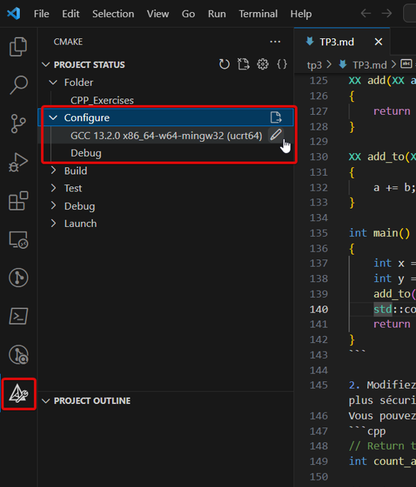
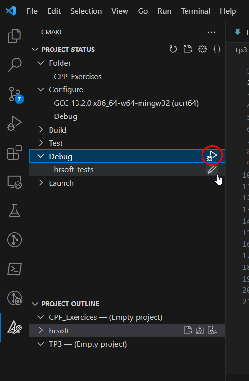
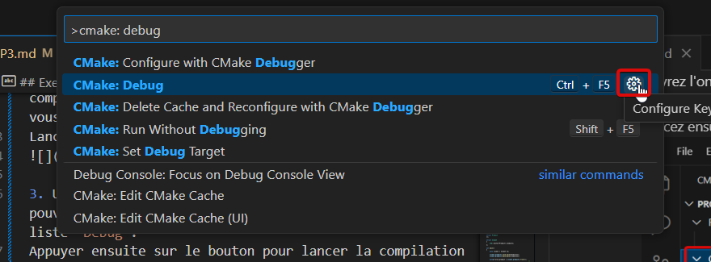

# TP3 - Cycle de vie

## Objectifs

- Dessiner des graphes d'ownership
- Identifier les dangling-references
- Identifier les relations d'ownership et d'agrégations
- Adapter la signature d'une fonction pour améliorer les performances
- Utiliser des références et des pointeurs-observants dans un programme

## Exercice 1 - Graphes d'ownership (50min)

### Cas A - Copie VS Référence

```cpp
#include <array>

struct Driver
{};

struct Wheel
{};

struct Car
{
    explicit Car(Driver& d)
    : driver { d }
    {}

    Driver&              driver;
    std::array<Wheel, 4> wheels;
};

int main()
{
    auto driver = Driver {};
    auto car = Car { driver };

    auto& first_wheel = car.wheels.front();
    auto  last_wheel = car.wheels.back();
                                                // <-- on est ici
    return 0;
}
```


1. Pourquoi n'y a-t-il pas de relation entre `last_wheel` et `wheels[3]` contrairement à `first_wheel` et `wheels[0]` ?

### Cas B - Pointeurs-observants

```cpp
struct Worker;

struct Worker
{
    const Worker* manager = nullptr; 
};

int main()
{
    Worker boss;
    Worker cto;
    Worker technician;

    cto.manager = &boss;
    technician.manager = &cto;
                                    // <-- on est ici
    return 0;
}
```


1. Dans le graphe d'ownership, comment distingue-t-on un pointeur d'une référence ?
2. Comment est représenté un pointeur nul ?
3. En termes de code, quelles sont les deux différences principales entre un pointeur-observant et une référence ?

### Cas C - Insertions dans un `std::vector`

```cpp
#include <memory>
#include <vector>

struct Product
{};

struct Client
{
    std::vector<Product> products;
};

int main()
{
    auto client = Client {};

    client.products.push_back(Product{});
    client.products.push_back(Product{});

    auto& first_product = client.products.front();
                                                    // <-- on est ici
    client.products.push_back(Product{});
    return 0;
}
```


Lors d'une insertion, si le buffer mémoire réservé par `std::vector` n'a pas la place de contenir le nouvel élément, alors le contenu du tableau est réalloué dans un tout nouveau buffer de taille suffisante.
Chaque élément est déplacé de son ancienne adresse mémoire vers la nouvelle.

1. Essayez de représenter les transitions dans le graphe d'ownership après le dernier `push_back` si celui-ci déclenchait une réallocation mémoire.
2. Quel problème relève-t-on dans le graphe ?
3. Modifiez le code ci-dessus afin que `products` contienne des pointeurs ownants. Pensez à ajouter un destructeur à `Client` pour libérer la mémoire allouée dynamiquement.
4. Redessinez le graphe d'ownership de la question 1, mais en prenant en compte vos changements dans le code.
5. Avez-vous toujours le problème relevé à la question 2 ?

## Exercice 2 - La meilleure signature (15min)

1. Remplacez les `XX` par les bons types, de manière à ce que le programme compile et affiche `10 42`.

```cpp
#include <iostream>

XX add(XX a, XX b)
{
    return a + b;
}

XX add_to(XX a, XX b)
{
    a += b;
}

int main()
{
    int x = 10;
    int y = add(x, x);
    add_to(y, 22);
    std::cout << x << " " << y << std::endl;
    return 0;
}
```

2. Modifiez si besoin les types des paramètres dans les fonctions ci-dessous pour que le passage soit le plus efficace et le plus sécurisé possible.  
Vous pouvez vous aider des commentaires pour comprendre comment les fonctions utilisent leurs paramètres.
```cpp
// Return the number of occurrences of 'a' found in string 's'.
int count_a_occurrences(std::string s);

// Update function of a rendering program.
// - dt (delta time) is read by the function to know the time elapsed since the last frame.
// - errors is a string filled by the function to indicate what errors have occured.
void update_loop(const float& dt, std::string& errors_out);

// Return whether all numbers in 'values' are positive.
// If there are negative values in it, fill the array 'negative_indices_out' with the indices
// of these values and set its size in 'negative_count_out'.
// ex: auto res = are_all_positive({ 1, -2, 3, -4 }, negative_indices, negative_count);
//    -> res is false, since not all values are positive
//    -> negative_indices contains { 1, 3 } because values[1] = -2 and values[3] = -4
//    -> negative_count is 2
bool are_all_positives(std::vector<int> values, int negative_indices_out[], size_t& negative_count_out);

// Concatenate 'str1' and 'str2' and return the result.
// The input parameters are not modified by the function.
std::string concatenate(char* str1, char* str2);
```

## Exercice 3 - Gestion des resources (55min)

Vous allez créer un logiciel permettant de gérer les salariés de votre entreprise.

Dans votre logiciel, vous devez connaître pour chaque salarié :
- son nom et prénom,
- son salaire mensuel,
- les autres salariés dont il est manager.

Chaque salarié travaille pour un seul et unique département (la R&D, le marketing, etc).

En tant que chef d'entreprise, vous voulez utiliser ce logiciel pour réaliser les actions suivantes :
1. lister tous les salariés,
2. lister tous les départements,
3. lister les personnes appartenant à un département précis,
4. lister tous les managers,
5. lister les subordonnés d'un manager,
6. embaucher un nouveau salarié,
7. licencier un salarié,
8. changer un salarié de département,
9. augmenter le salaire d'une personne,
10. afficher la somme totale payée pour les salaires par département.

### 1. Architecture (15min)

Dans votre programme, vous aurez les classes suivantes :
- `HRSoftSystem` : représente le système et toutes les données sur lesquelles il opère
- `Employee` : représente un employé
- `Department` : représente un département

On vous propose trois architectures différentes pour le programme :

**Architecture A**


**Architecture B**


**Architecture C**


Pour chacune d'entre elles, vous indiquerez les opérations que le programme devrait effectuer pour satisfaire chacun des besoins cités plus haut, sans jamais introduire de dangling-reference.

### 2. Compilation via CMake (10min)

Le projet est déjà partiellement implémenté selon l'**architecture B**.  
Il contient un `CMakeLists.txt` permettant de compiler le programme.

1. Ouvrez le fichier [3-hrsoft/CMakeLists.txt](3-hrsoft/CMakeLists.txt) et regardez son contenu.  
Quels sont les exécutables présents dans ce projet ?

Vous allez maintenant compiler le programme à l'aide de CMake depuis VSCode.

2. Ouvrez l'onglet CMake et assurez-vous que le compilateur sélectionné correspond au compilateur que vous utilisez d'habitude.  
Lancez ensuite la configuration du projet.


3. Une fois la configuration terminée, vous devriez pouvoir sélectionner la cible `hr-soft-tests` dans la liste `Debug`.
Appuyez ensuite sur le bouton pour lancer la compilation et l'exécution du programme.


4. La compilation et l'exécution peuvent aussi être faites via `Ctrl+Shift+P > CMake: Debug`. Ajoutez un raccourci clavier sur cette commande si vous n'en avez pas déjà un.


### 3. Implémentation du système (30min)

La fonction `main` de `hrsoft-tests` se trouve à l'intérieur de [HRSoftTests.cpp](3-hrsoft/HRSoftTests.cpp).  
Ce programme instancie les mêmes données que celles présentées dans les schémas de la partie 1.

1. Commencez par prendre connaissance de [HRSoftTests.cpp](3-hrsoft/HRSoftTests.cpp) ainsi que des fichiers contenus dans le dossier [HRSoft](3-hrsoft/HRSoft).  
Pour quelle raison le programme utilise-t-il des `std::list` plutôt que des `std::vector` pour stocker les départements et les employés ?  
Si vous ne trouvez pas, remplacez les `list` par des `vector` et lancez le programme en mode Debug pour observer le comportement.
En particulier, utilisez le debugger pour surveiller le contenu de `rd_dpt`.

2. Implémentez la fonction `print_employees` dans la classe `Department` (notez que `operator<<` est déjà fourni pour `Employee`).  
Faites de même pour `print_all_departments` et `print_all_employees` dans la classe `HRSoftSystem`.  
Décommentez les instructions correspondantes dans [HRSoftTests.cpp](3-hrsoft/HRSoftTests.cpp) pour vérifier que tout fonctionne.

3. Implémentez maintenant le contenu de la fonction `Employee::add_subordinate` et définissez la fonction-membre `print_subordinates`.  
Vérifiez que tout fonctionne après avoir décommenté les instructions correspondantes dans le `main`.

4. Définissez maintenant la fonction `remove_employee` de la classe `System`. N'hésitez pas à ajouter d'autres fonctions dans les autres classes si vous en avez besoin.  
Prenez bien garde à ne pas laisser de pointeurs-observants sur l'employé retiré du système.
Décommentez les dernières instructions du `main` pour vous assurer que tout fonctionne.

### 4. (Bonus) Implémentation de HRSoft (1h30)

1. Dans l'onglet CMake, modifiez la cible d'exécution pour `hrsoft`. La fonction `main` de ce programme se trouve à l'intérieur de `3-hrsoft/HRSoftMain.cpp`.

2. Finalisez l'implémentation du programme afin qu'il supporte tous les besoins demandés :
    - la commande `"d market"` permet d'ajouter un département `market`,
    - la commande `"l"` lister tous les départements,
    - la commande `"e toto 1250 tata"` permet d'ajouter un employé `toto` payé 1250€ ayant pour manager `tata`,
    - la commande `"k"` permet de lister tous les salariés,
    - la commande `"f toto"` permet de supprimer l'employé nommé `toto`,
    - la commande `"n market"` permet de lister tous les salariés du département `market`,
    - la commande `"m"` permet de lister tous les managers,
    - la commande `"m tata"` permet de lister tous les subordonnés de `tata`,
    - la commande `"t toto r&d"` permet de transférer l'employé `toto` au département `r&d`,
    - la commande `"r toto 200"` permet d'augmenter le salaire de `toto` de 200€,
    - la commande `"s"` permet d'afficher pour chaque département la somme des salaires des employés qu'il contient.

Notez bien que les fonctions `parse_name` et `parse_salary` permettent de récupérer les arguments entrés par l'utilisateur.
