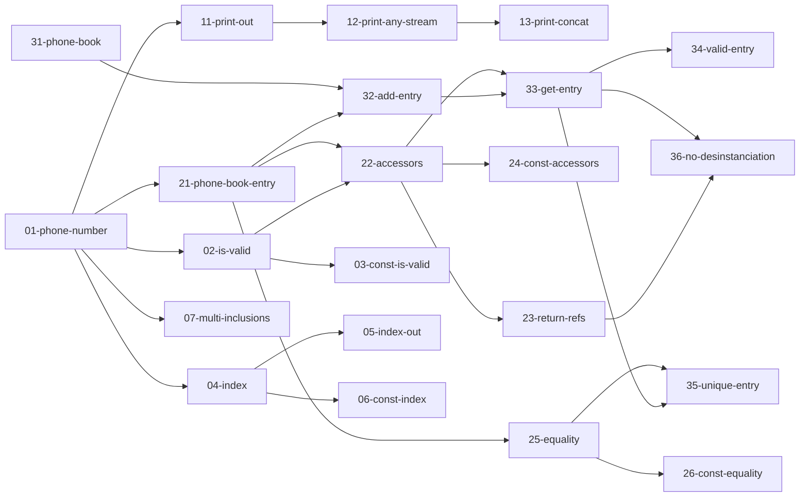

# TP4 - Révisions

## Objectifs

- Découvrir le format des TPs notés
- Lancer les tests unitaires
- Revoir les différentes notions du cours

## Amorce de la séance

Avant le début de l'examen, on vous demandera de prendre place à vos machines, de vous connecter et d'exécuter une commande qui servira à extraire les différents fichiers au bon endroit sur la machine.

Une fois l'examen commencé, vous pourrez double-cliquer sur le fichier `${HOME}/launch_vscode.sh` pour ouvrir le dossier du TP noté dans VSCode.  
Si à un moment, vous devez réouvrir VSCode, passez toujours par le script `${HOME}/launch_vscode.sh`.
Cela vous évitera les **lags habituels du mode exam** ainsi que d'autres soucis de configuration.

### Documentation

Vous aurez accès à différentes ressources pour vous débloquez si nécessaire pendant la séance :
- une version statique du cours en ligne,
- [une version statique de cppreference](../resources/cppreference),
- [les slides du cours magistral](../resources/slides).

### Contenu du dossier

Le dossier du TP noté sera extrait dans `${HOME}/EXAM/`.

Il sera structuré à peu près de la même manière que le dossier de ce TP4.
- `cmake`: un dossier contenant des fichiers de configuration pour CMake
- `exN`: le code de l'exercice n°N
  - `src`: **les fichiers de code que vous devrez modifier**
  - `tests`: les fichiers contenant les **tests unitaires** à faire passer
- `extern`: contient des librairies externes, notamment la librairie Catch2 pour les tests unitaires
- `CMakeLists.txt`: le fichier de configuration pour CMake
- `TPNx.md` ou `TPNx.pdf`: le sujet du TP

Tous les fichiers que vous aurez **à modifier ou à ajouter** se trouvent dans **`src`**.  
Vous devrez aller consulter le contenu de `tests`, mais il ne faudra en aucun cas modifier les fichiers.  
Si vous arrivez à faire passer un test en le réécrivant, vous n'aurez pas les points !

Ne vous préoccupez pas du restant des fichiers, ils sont là pour faire en sorte que tout fonctionne.

## Compilation et exécution

Lorsqu'on utilise CMake, les fichiers sont générés dans un répertoire séparé des sources.  
Cela permet d'isoler le code, qui est portable et à vocation à être partagé, des fichiers que vous générez pour vous seul.

La première étape correspond à la configuration du projet, qui permet de référencer les exécutables à compiler et avec quelles options.  
Pour cela, vous pouvez soit utiliser la commande `CMake: Configure` de VSCode (accessible avec le raccourci `Ctrl + Shift + P`), soit lancer les commandes suivantes dans un terminal :
```b
# Créer le dossier qui contiendra les fichiers générés
mkdir build

# Rentre à l'intérieur du dossier `build`
cd build

# Configure le projet afin qu'il utilise le CMakeLists.txt dans `tp4` et place les fichiers générés dans `build`
cmake -S chemin/vers/le/dossier/tp4 -B .
```

Une fois la configuration terminée, compilez le framework de tests unitaires avec la commande suivante :
```b
cmake --build . --target Catch2WithMain -j
```

Enfin, vous pouvez compiler les tests et les exécuter à partir du script `run_tests.sh` généré dans votre dossier de build.
```b
# Lance la compilation et l'exécution de tous les tests unitaires
./run_tests.sh

# Lance la compilation et l'exécution des tests contenant le pattern donné
./run_tests.sh <pattern>

# Par exemple
./run_tests.sh ex2      # => tous les tests de l'exercice 2
./run_tests.sh ex2-1    # => exercice 2, tests 10 à 19
./run_tests.sh ex2-23   # => exercice 2, test 23 uniquement
```

Chaque fois que vous réussirez à faire passer un test unitaire, les fichiers-sources concernés seront sauvegardés dans le dossier [backup](backup).  
Ainsi, si vous vous rendez compte que vos dernières modifications ont cassé votre code, vous pourrez retrouver la dernière version fonctionnelle de vos fichiers dans ce dossier.

## Exercice 1 - Vrai ou Faux (20 min)

Le premier exercice est un vrai ou faux.

Ouvrez le fichier [ex1/src/qcm.hpp](ex1/src/qcm.hpp).  
Vous devez indiquer pour chaque proposition si celle-ci est vraie (`true`) ou fausse (`false`).  
Attention, une réponse incorrecte peut vous retirer des points, donc laissez le champ vide si vous ne savez pas.

Par exemple, si je sais que Victor a les cheveux courts, que Céline a les cheveux longs, mais que je ne sais pas pour Antoine, je réponds :
```cpp
// Question 1
// Victor a les cheveux longs.
#define ANSWER_1 false

// Question 2
// Céline a les cheveux longs.
#define ANSWER_2 true

// Question 3
// Antoine a les cheveux longs.
#define ANSWER_3
```

Si vous exécutez `./run_tests.sh ex1`, le test associé deviendra vert dès lors que vous aurez répondu à toutes les questions (même si vous avez mal répondu).

## Exercice 2 - Implémentation d'un répertoire téléphonique (60min)

Dans ce type d'exercice, vous devez coder différentes classes et fonctions afin de faire passer les tests unitaires fournis.  
Avec le framework Catch2, les tests unitaires ont la forme suivante :
```cpp
TEST_CASE("Titre du test")
{
  // Des instructions...
  REQUIRE(/** une assertion **/);

  // D'autres instructions...
  REQUIRE(/** une autre assertion **/);
}
```
Dans un premier temps, il faut réussir à implémenter le code permettant au test de **compiler**.  
La seconde étape est d'adapter ce code afin qu'**il se comporte comme attendu** (c'est-à-dire que les conditions spécifiées dans les `REQUIRE` s'évaluent à `true`).

Ouvrez le premier fichier de tests [ex2/tests/01-phone-number.cpp](ex2/tests/01-phone-number.cpp).  
Le but est de définir une classe `PhoneNumber`, qui servira à représenter un numéro de téléphone.  
Ajoutez le fichier requis par le test et implémentez son contenu.

Une fois que vous pensez avoir terminé, utilisez `./run_tests.sh ex2-01` pour compiler et exécuter ce premier test.  
Si vous avez réussi à le faire passer, passez au test suivant.

### Dépendances

Certains tests sont dépendants les uns des autres.  
Le graphe ci-dessous vous indique les dépendances en question.



### Conseils

1. Attention aux régressions ! Relancez régulièrement l'intégralité des tests de l'exercice avec `./run_tests.sh ex2` pour vous assurez que vos dernières modifications n'ont pas cassé un test qui passait précédement.
2. Ne restez pas bloqué trop longtemps sur la même question. La plupart des tests sont indépendants, donc n'hésitez pas à avancer et à revenir sur ceux qui vous posaient problème s'il vous reste du temps à la fin de la séance.

## Exercice 3 - Code à trous (20min)

Le dernier type d'exercice est un texte à trou, mais avec du code.
Vous devez donner une valeur à chacune des constantes `ANSWER_X` de manière à faire en sorte que le test passe.
Notez que parfois, la bonne réponse est "rien". Laissez alors la valeur de la constante vide.

Dans ce genre d'exercice, les tests vous indiquent si le code compile, mais pas forcément si vos réponses sont bien celles attendues.

Par exemple, pour le test [ex3/tests/01-types.cpp](ex3/tests/01-types.cpp), on attend que vous trouviez le prototype (type de retour et types des paramètres) optimal pour chacune des déclarations de fonctions.  
Si le test passe, cela signifie simplement que vos réponses permettent au code de compiler, pas nécessairement que vous avez utilisé les bons types.
