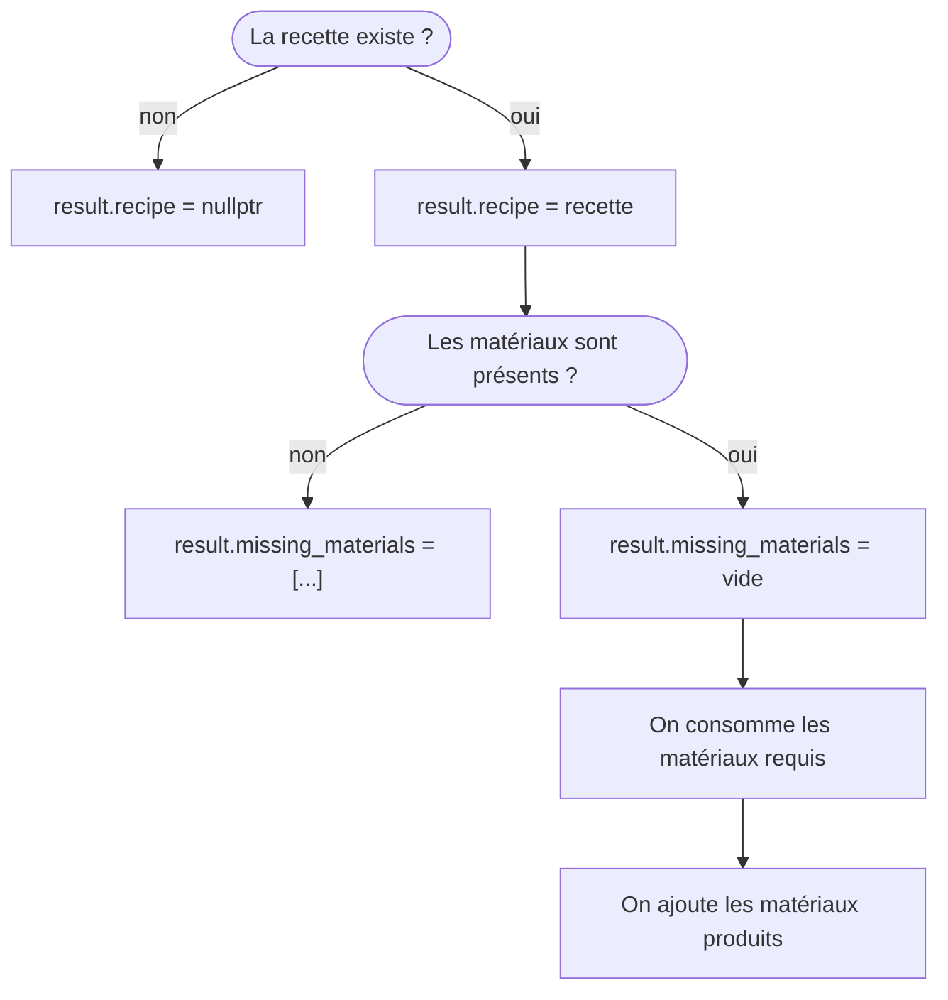

# TP5 - Copie et déplacement

## Objectifs

- Identifier les l-values et les r-values
- Comprendre le mécanisme du déplacement
- Se familiariser avec l'utilisation des `unique_ptr`

## Exercice 1 - l-value ou r-value ? (15 min)

1. Identifiez si les expressions ci-dessous sont des l-values ou des r-values et justifiez.  

a. `i` est un `int`  
```cpp
4
4 + i
i
i = 4
i == 4
```

b. `vec` est un `std::vector<char>`
```cpp
vec[5]
vec
vec.pop_back()
std::vector { 'a', 'b', 'c' }
vec.push_back('d')
std::move(vec)
```

c. `ptr` est un pointeur de `int`
```cpp
ptr + 3
*(ptr + 3)
*ptr + 3
```

d. `str` est une `std::string`
```cpp
std::string { "aaaa" }
str
str + "aaaa"
str += "aaaa"
"aaaa"
```

2. Supposons que vous ayiez l'instruction : `Class inst { expr }`.  
Quelles sont les deux conditions pour que le constructeur de copie soit appelé ?  
Même question pour le constructeur de déplacement ?

## Exercice 2 - CopyablePtr (60 min)

Dans cet exercice vous allez implémenter votre propre pointeur intelligent.  
Cela vous permettra de mieux comprendre comment fonctionnent les smart-pointers proposés par la librairie standard.

Avant de commencer à coder, voici les instructions pour configurer le projet CMake, compiler le programme et le lancer :
```b
# Configurer le projet dans un dossier de build
cmake -B <chemin_vers_le_dossier_build> -S <chemin_vers_le_dossier_tp5>

# Compiler le programme
cmake --build <chemin_vers_le_dossier_build> --target tp5-ex2

# Lancer le programme
<chemin_vers_le_dossier_build>/tp5-ex2
```

Vous allez définir une classe `CopyablePtr` qui permettra de stocker une instance de `Object` allouée dynamiquement.  
Contrairement à `std::unique_ptr`, votre classe supportera la copie et allouera dans ce cas une nouvelle instance d'`Object` pour contenir la copie.  

La classe `Object` est prédéfinie de manière à logger chacune des opérations liées à sa durée de vie ou à son contenu.  
Pour chacune des questions, vous décommenterez les instructions associées dans le `main` et vérifierez que vous avez la sortie attendue.  
Si vous ajoutez des fichiers, pensez à modifier le [CMakeLists.txt](CMakeLists.txt).

### A. Fonctions de base

1. Décommentez l'instruction correspondant à la question 1 dans le fichier [main.cpp](2-ptr/main.cpp).  
Vérifiez que le programme compile et qu'il affiche : `"Debut des tests`.

2. Définissez une classe `CopyablePtr` dans le dossier [2-ptr](2-ptr).    
Ajoutez-lui un attribut de type `Object*` ainsi qu'un opérateur d'égalité dont la seconde opérande sera de type `std::nullptr_t` (il s'agit du type du littéral `nullptr`). Cet opérateur vérifiera si l'attribut est null.

3. Ajoutez un constructeur acceptant un paramètre de type entier.  
Celui-ci allouera dynamiquement une instance d'`Object` avec `new`, initialisée avec la valeur passée en paramètre.  Assurez-vous également que les instructions de la question précédente compilent toujours.

4. Vous allez maintenant implémenter l'opérateur de déréférencement, qui vous permettra d'accéder au contenu de votre smart-pointer.  
Voici sa signature : `CopyablePtr::operator*() const`.  
Assurez-vous que cette opération n'engendre aucune copie ou déplacement de `Object` lors du retour de la fonction.

5. Implémentez un operateur d'assignation pour le type `nullptr_t`, qui permettra de vider le pointeur sans provoquer de fuite de mémoire.  
La signature est : `CopyablePtr::operator=(std::nullptr_t)`.

### B. Constructeurs de copie et déplacement

1. Ajoutez un constructeur de copie à votre classe.  
Ce constructeur allouera un nouvel `Object` à partir de l'`Object` contenu dans le pointeur passé en paramètre.

2. Assurez-vous que votre constructeur est aussi capable de copier un `CopyablePtr` vide.

3. Vous allez maintenant implémentez le constructeur de déplacement.
Attention, pour cette opération, on ne veut pas qu'un nouvel `Object` soit alloué.
On souhaite simplement que le pointeur-nu du `CopyablePtr` passé en paramètre soit "transféré" dans le `CopyablePtr` généré par le constructeur.

### C. Assignation par copie

1. On souhaite maintenant gérer la réassignation par copie des `CopyablePtr`.  
Définissez l'opérateur adéquat et assurez-vous que le code fonctionne comme attendu.

2. Vérifiez maintenant que si le `CopyablePtr` contenait déjà un `Object`, celui-ci est bien détruit avant qu'une nouvelle instance soit créée.  

3. Enfin, assurez-vous que la réassignation d'un `CopyablePtr` par lui-même ne produise pas d'effets indésirables.

### D. Assignation par déplacement

1. De la même manière que pour la construction par déplacement, vous allez implémenter un opérateur d'assignation par déplacement qui n'allouera aucun nouvel `Object`.  
Le pointeur-nu contenu dans l'instance passé en paramètre sera "volé" par l'instance courante, après avoir détruit l'`Object` que celle-ci contenait préalablement.

2. Vérifiez que la réassignation d'un `CopyablePtr` par lui-même n'a pas d'effet.

### E. Destruction

Implémentez le destructeur de la classe afin de corriger les fuites de mémoire présentes dans votre programme.  
Utilisez `valgrind` pour vérifier que votre programme ne présente aucun problème de mémoire.

### F. (Bonus) Copy and Swap 

Il est possible de ne définir qu'un seul opérateur d'assignation pour gérer à la fois la copie et le déplacement, en utilisant un pattern appelé "Copy and Swap".

Cherchez de quoi il s'agit sur Internet, commentez vos opérateurs d'assignation par copie et par déplacement, et implémentez un opérateur d'assignation permettant de gérer ces deux opérations à la fois.

## Exercice 3 - Recettes (75 min)

Vous allez créer un programme qui vous permet de fabriquer des objets à partir de matériaux suivant une recette.  
Par exemple, je pourrais avoir la recette "Caillou Bâton => Marteau", qui nécessite d'utiliser un caillou et un bâton pour produire un marteau.

Certaines recettes implique l'usage d'outils.  
Ceux-ci sont considérés comme des matériaux, au même titre que les autres, mais sont restitués à la fin de la recette : "Caillou Marteau => Sable Marteau".

### A. Existant

Le squelette du programme est déjà implémenté.

1. Commencez par le compiler et lancez-le afin de vous familiariser avec son fonctionnement (vous ne devriez pas avoir besoin de lire le code pour cette étape).  
Vous devriez rapidement constater qu'à part le parsing des commandes utilisateur, ce programme ne semble pas faire grand chose.

```b
# Configurer le projet dans un dossier de build
cmake -B <chemin_vers_le_dossier_build> -S <chemin_vers_le_dossier_tp5>

# Compiler le programme
cmake --build <chemin_vers_le_dossier_build> --target tp5-ex3

# Lancer le programme
<chemin_vers_le_dossier_build>/tp5-ex3
```

2. Ouvrez le fichier [`ProgramData.hpp`](./3-recipes/ProgramData.hpp) : il contient la classe `ProgramData`, dont chacune des fonctions est appelée par l'une des commandes utilisateur.  
Ouvrez maintenant le fichier [`ProgramData.cpp`](./3-recipes/ProgramData.cpp).  
Pourquoi le programme ne fait rien ? 

### B. Matériaux

Pour le restant de l'exercice, n'hésitez pas à ajouter les fonctions qui vous sembleraient pertinentes, même si on ne vous les demande pas explicitement. 

1. Commencez par définir une classe `Material` qui contiendra un attribut `_name` de type `std::string`.
2. Modifiez le contenu de l'`operator<<` acceptant un `Material` afin d'afficher son nom.
3. Faites en sorte qu'à la construction d'un `Material`, on affiche : `"<name> was created"` et qu'à sa destruction, on affiche `"<name> was destroyed"`.
4. Implémentez le contenu de la fonction `ProgramData::add_material`.  
Vous ajouterez un nouvel attribut à la classe `ProgramData` pour y stocker les matériaux.
Individuellent, chacun d'entre eux sera alloué via `std::make_unique<Material>` et sera conservé sous forme de `std::unique_ptr<Material>`.
5. Testez la commande `"m <name>"` plusieurs fois d'affilée, puis quitter le programme avec `"q"`, afin de vous assurez-vous via les logs du programme que chaque `Material` créé est détruit une seule et unique fois.
6. Implémentez ensuite la fonction `ProgramData::get_materials`.  
Vous pouvez utiliser la fonction-membre `get` de `unique_ptr` pour récupérer un pointeur-observant sur son contenu. 
7. (Bonus) Limitez les copies au maximum en **déplaçant** les objets que vous aurez besoin de stocker.

### C. Recettes

1. Ajoutez une classe `Recipe`, qui contiendra deux attributs `_materials` et `_products` de type `std::vector<std::string>`, et un attribut `_id` de type `size_t`.
Cet identifiant correspondra au numéro de la recette (la première recette ayant pour identifiant `1` et non `0`).
2. Implémentez le contenu de l'`operator<<` pour `Recipe`. Celui-ci affichera l'idenfiant de la recette ainsi que sa formule.  
Par exemple : `"(1) Eau Sirop => Grenadine"`
3. Modifiez le contenu de `register_recipe` de manière à stocker les recettes enregistrées dans `ProgramData`.  
4. Implémentez maintenant `collect_doable_recipes`, qui remplit le tableau passé en paramètre avec des pointeurs-observants sur les recettes dont les matériaux requis sont disponibles dans l'inventaire.
5. Testez que les commandes `"m"`, `"r"` et `"t"` fonctionnent comme elles le devraient.
6. (Bonus) Adaptez votre code afin de gérer les recettes qui nécessite plusieurs `Material` avec le même nom.
7. (Bonus) Limitez les copies au maximum en déplaçant les paramètres que vous aurez besoin de stocker.

### D. Production

1. Implémentez maintenant le contenu de la fonction `produce`.  
Pour simuler la consommation d'un matériau, vous pourrez vous contenter d'assigner `nullptr` au `unique_ptr` le contenant.


2. Vérifiez que la commande `p` fonctionne.  
Si vous avez des **segfaults**, c'est probablement parce que vous n'avez pas adapté le code existant au fait que les pointeurs de votre conteneur peuvent maintenant être nuls. 
3. (Bonus) Passer les `unique_ptr` à `nullptr` permet de désinstancier le `Material` contenu dedans.  
Cependant, vous avez tout de même une fuite de mémoire, puisque le `unique_ptr` vide occupe toujours de l'espace dans le conteneur des matériaux.  
Consultez la documentation du conteneur que vous avez choisi d'utiliser, et faites en sorte de supprimer le pointeur du conteneur plutôt que de le passer à `nullptr`. 
