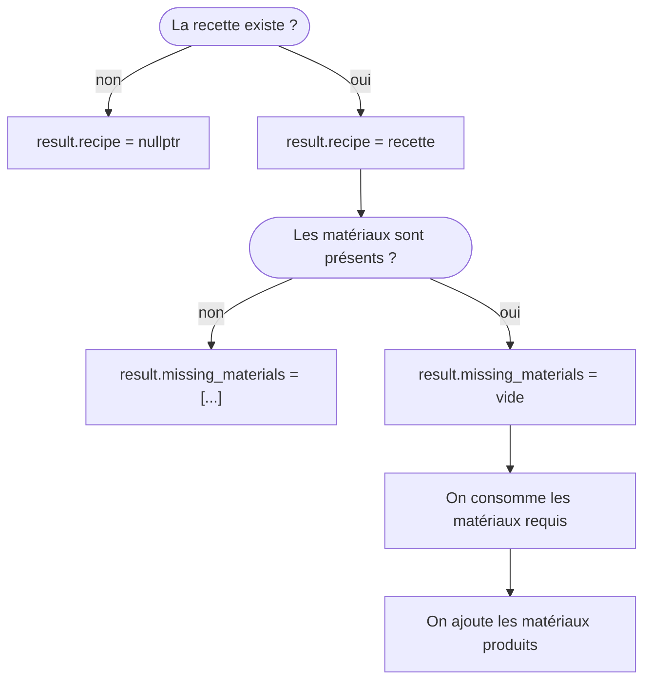

# TP6 - unique_ptr

## Objectifs

- Se familiariser avec l'utilisation des `unique_ptr`
- Manipuler des pointeurs-observants

## Exercice - Recettes (2h)

Vous allez créer un programme qui vous permet de fabriquer des objets à partir de matériaux suivant une recette.  
Par exemple, je pourrais avoir la recette "Caillou Bâton => Marteau", qui nécessite d'utiliser un caillou et un bâton pour produire un marteau.

Certaines recettes implique l'usage d'outils.  
Ceux-ci sont considérés comme des matériaux, au même titre que les autres, mais sont restitués à la fin de la recette : "Caillou Marteau => Sable Marteau".

### A. Existant

Le squelette du programme est déjà implémenté.

1. Commencez par le compiler et lancez-le afin de vous familiariser avec son fonctionnement (vous ne devriez pas avoir besoin de lire le code pour cette étape).  
Vous devriez rapidement constater qu'à part le parsing des commandes utilisateur, ce programme ne semble pas faire grand chose.

```b
# Configurer le projet dans un dossier de build
cmake -B <chemin_vers_le_dossier_build> -S <chemin_vers_le_dossier_tp5>

# Compiler le programme
cmake --build <chemin_vers_le_dossier_build> --target tp5-ex3

# Lancer le programme
<chemin_vers_le_dossier_build>/tp5-ex3
```

2. Ouvrez le fichier [`ProgramData.hpp`](./3-recipes/ProgramData.hpp) : il contient la classe `ProgramData`, dont chacune des fonctions est appelée par l'une des commandes utilisateur.  
Ouvrez maintenant le fichier [`ProgramData.cpp`](./3-recipes/ProgramData.cpp).  
Pourquoi le programme ne fait rien ? 

### B. Matériaux

Pour le restant de l'exercice, n'hésitez pas à ajouter les fonctions qui vous sembleraient pertinentes, même si on ne vous les demande pas explicitement. 

1. Commencez par définir une classe `Material` qui contiendra un attribut `_name` de type `std::string`.
2. Modifiez le contenu de l'`operator<<` acceptant un `Material` afin d'afficher son nom.
3. Faites en sorte qu'à la construction d'un `Material`, on affiche : `"<name> was created"` et qu'à sa destruction, on affiche `"<name> was destroyed"`.
4. Implémentez le contenu de la fonction `ProgramData::add_material`.  
Vous ajouterez un nouvel attribut à la classe `ProgramData` pour y stocker les matériaux.
Individuellent, chacun d'entre eux sera alloué via `std::make_unique<Material>` et sera conservé sous forme de `std::unique_ptr<Material>`.
5. Testez la commande `"m <name>"` plusieurs fois d'affilée, puis quitter le programme avec `"q"`, afin de vous assurez-vous via les logs du programme que chaque `Material` créé est détruit une seule et unique fois.
6. Implémentez ensuite la fonction `ProgramData::get_materials`, qui remplit le tableau en paramètre avec la liste des matériaux présents dans l'inventaire.
Vous pouvez utiliser la fonction-membre `get` de `unique_ptr` pour récupérer un pointeur-observant sur son contenu. 
7. (Bonus) Limitez les copies au maximum en **déplaçant** les objets que vous aurez besoin de stocker.

### C. Recettes

1. Ajoutez une classe `Recipe`, qui contiendra deux attributs `_materials` et `_products` de type `std::vector<std::string>`, et un attribut `_id` de type `size_t`.
Cet identifiant correspondra au numéro de la recette (la première recette ayant pour identifiant `1` et non `0`).
2. Implémentez le contenu de l'`operator<<` pour `Recipe`. Celui-ci affichera l'idenfiant de la recette ainsi que sa formule.  
Par exemple : `"(1) Eau Sirop => Grenadine"`
3. Modifiez le contenu de `register_recipe` de manière à stocker les recettes enregistrées dans `ProgramData`.  
A la fin de l'ajout, affichez dans la console `"Recipe <...> has been registered"`.  
4. Testez que la commande `"r"` fonctionnent comme elles le devraient.
5. Implémentez maintenant `collect_doable_recipes`, qui remplit le tableau passé en paramètre avec des pointeurs-observants sur les recettes dont les matériaux requis sont disponibles dans l'inventaire.
6. Testez que les commandes `"m"`, `"r"` et `"t"` fonctionnent correctement.
7. (Bonus) Adaptez votre code afin de gérer les recettes qui nécessite plusieurs `Material` avec le même nom.
8. (Bonus) Limitez les copies au maximum en déplaçant les paramètres que vous aurez besoin de stocker.

### D. Production

1. Implémentez maintenant le contenu de la fonction `produce`.  
Pour simuler la consommation d'un matériau, vous pourrez vous contenter d'assigner `nullptr` au `unique_ptr` le contenant.


2. Vérifiez que la commande `p` fonctionne.  
Si vous avez des **segfaults**, c'est probablement parce que vous n'avez pas adapté le code existant au fait que les pointeurs de votre conteneur peuvent maintenant être nuls. 
3. (Bonus) Passer les `unique_ptr` à `nullptr` permet de désinstancier le `Material` contenu dedans.  
Cependant, vous avez tout de même une fuite de mémoire, puisque le `unique_ptr` vide occupe toujours de l'espace dans le conteneur des matériaux.  
Consultez la documentation du conteneur que vous avez choisi d'utiliser, et faites en sorte de supprimer le pointeur du conteneur plutôt que de le passer à `nullptr`. 
